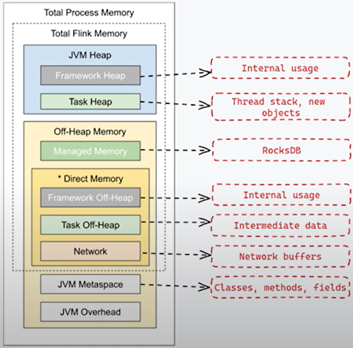

## Install Spark
```shell
curl -o flink-1.20.0-bin-scala_2.12.tgz https://dlcdn.apache.org/flink/flink-1.20.0/flink-1.20.0-bin-scala_2.12.tgz

sudo mv flink-1.20.0-bin-scala_2.12.tgz /opt/ 
sudo tar xvf flink-1.20.0-bin-scala_2.12.tgz
sudo mv flink-1.20.0 /opt/flink
sudo rm -rf flink-1.20.0-bin-scala_2.12.tgz


vi ~/.bashrc

# paste following to bottom 
export FLINK_HOME=/opt/flink
export PATH=$PATH:$FLINK_HOME/bin
export PATH=$PATH:$FLINK_HOME/sbin
```


# Docker Compose File
```yml
version: '2'
services:
 flink-master:
   image: bde2020/flink-master:1.14.5-hadoop3.2
   hostname: flink-master
   container_name: flink-master
   volumes:
     - /home/enver/udemy-flink:/opt
   ports:
     - "8080:8080"
     - "8081:8081"

 flink-worker:
   image: bde2020/flink-worker:1.14.5-hadoop3.2
   hostname: flink-worker
   container_name: flink-worker
   volumes:
     - /home/enver/udemy-flink:/opt
   environment:
     - FLINK_MASTER_PORT_6123_TCP_ADDR=flink-master
#     - FLINK_NUM_TASK_SLOTS=2
   depends_on:
      - flink-master

```
# How to run Flink
```shell
docker exec -it flink-master bash

#WordCount Class as default class, other class 
flink run Flink.jar --input file:///opt/wc.txt --output file:///opt/wc_out.csv
flink run Flink.jar --input file:///opt/wc.txt 
flink run -c com.f02.JoinExample1 Flink.jar
flink run Flink.jar
```
# Flink Memory Model

# Reading data from Files for DataSet
```java
DataSet<String> text = env.readTextFile(path);
DataSet<String> text = env.readCsvFiles(path) //return tuple2<String,Integer> to Tuple25<...>
DataSet<String> text = env.readFileOfPrimitives(path,Class)
DataSet<String> text = env.readFileOfPrimitives(path,delimeter, Class)
DataSet<String> text = env.readHadoopFile(FileFormat, KeyType, ValueType, Path)
DataSet<String> text = env.readSequenceFile(KeyType, ValueType, Path)
```

# Join Optimization Options for better performance
```java
DataSet<...> joined = firstSet.join(secondSet,JoinHint.OPTIMIZER_CHOOSES);//....

public enum JoinHint {
   OPTIMIZER_CHOOSES ,         //Default Optimization
   BROADCAST_HASH_FIRST,    //if First dataset is small, it will be distributed all nodes fully.
   BROADCAST_HASH_SECOND,//if Second dataset is small, it will be distributed all nodes fully.
   REPARTITION_HASH_FIRST,  //build hash table from First Dataset.. Both dataset are big. choose the smaller dataset for hashing
   REPARTITION_HASH_SECOND,//build hash table from Second Dataset.. Both dataset are big. choose the smaller dataset for hashing
   REPARTITION_SORT_MERGE; //if bothsides are already sorted
}
```

# Reading data from Files for DataStream
```java
DataStream < String > text = env.socketTextStream("localhost", 9999); //nc -l 9999
DataStream < String > text = env.readTextFile(path);
DataStream < String > text = env.readFile(fileformat,path);
DataStream < String > text = env.readFile(fileFormat,path,watchType,interval,pathFilter);
        //fieFormat: Text, Csv, Avro, Parquet, SequenceFile, Json, Orc,KeyValue, Regex,Binary,  FileInputFormat<MyType>
        //watchType: FileProcessingMode.PROCESS_CONTINUOUSLY, check the path with Interval duration for any new file
        //watchType: FileProcessingMode.PROCESS_ONCE, file will be read and set a checkpoint. if run again, it will run from checkpoint
        //pathFilter: if we give Path parameter as Folder, we can excludes specific file type
        //pathFilter: Default FilePathFilter
        FilePathFilter pathFilter = FilePathFilter.createDefaultFilter(); //exclude Files that start with a dot
        //pathFilter: Custom FileFilter
        public class CustomExtensionFilePathFilter extends FilePathFilter {
            @Override
            public boolean filterPath(Path filePath) {
                return !filePath.getPath().endsWith(".txt");
                FileStatus fileStatus = filePath.getFileSystem().getFileStatus(filePath);
                return fileStatus.getLen() < minFileSize;
                FileStatus fileStatus = filePath.getFileSystem().getFileStatus(filePath);
                return filePath.getPath().startsWith(".") || fileStatus.getLen() < minFileSize;
            }
        }
addSource() // External DataSource Kafka, Flume, Twitter API
```

# Writing data 
```java
DataStream.writeAsText(path);
DataStream.writeAsCsv(path,line delimeter, field delimeter);
DataStream.print();
DataStream.writeUsingOutputFormat();
DataStream.writeToSocket();
DataStream.addSink();
```


# reading data from Kafka
```shell
kafka-console-consumer --bootstrap-server localhost:9092 --topic financial_transactions --from-beginning
```

# Windowing: 
  Windows split the data stream into buckets of finite size over which computations can be applied.
  Tumbling Window:
  Sliding Window:
  Session Window:
  Global Window:

  Non Keyed Stream --> windowAll()
  Keyed Stream (KeyBy) --> window()

## Time Concept of Window
Source --> Flink Ingestion --> Processing
```java  
  public enum TimeCharacteristic {
    ProcessingTime,
    IngestionTime,
    EventTime;
  }
```

Window Create --> Trigger -->beforeEvict --> Window Function -->afterEvict--> Result
window()/WindowAll trigger()                   Reduce,fold,aggregate

## Watermarks
Customer Watermark implements AssignerWithPunctuatedWatermarks or AssignerWithPeriodicWatermarks interfaces.. 

## Builtin Watermarks Generators
```java
.assignTimestampsAndWatermarks(new BoundedOutOfOrdernessTimestampExtractor<event>(Time.seconds(10)) {
  public long extractTimestamp(TimeAndText element, long previousElementTimestamp) {
			long timestamp = element.getTimestamp();
			currentMaxTimestamp = Math.max(timestamp, currentMaxTimestamp);
			return timestamp;
		}
})
```

```java
.assignTimestampsAndWatermarks(new AscendingTimestampExtractor<TimeAndText>()
      {
        public long extractAscendingTimestamp(TimeAndText t)
        {
          return t.getTimestamp();
        }
      })
```

# State, Checkpoint and Fault Tolerance

## Barrier Snapshotting
  Synchronous snapshot  = Flink Operator will stop processing neew records while snapshot/checkpoint is being written
  Asynchronous snapshot = Flink Operator will NOT stop processing neew records while snapshot/checkpoint is being written
    Requirement for Async snapshot: 
      1. Use the managed stated by Flink 
      2. Use a state backend which supports Async (Memory + RocksDB StateBackends)

## State Backends: 
  - Memory StateBackend: Stores the state data internally as object in Java Heap
  - FS StateBackend: Stores the state data internally into specified file system ex:HDFS
  - RocksDB StateBackend: Stores the in-flight data (temp data) in RocksDB, Upon checkpointing the same db is written to filesystem

## Incremental Checkpointing
It will store just latest updates after previous checkpoints. 
 - Snapshots get bigger and bigger GB vise data. 
 - Synchronous Checkpoints stops operators

 ## State Types:
  - Operator State: bound to 1 operator instance, 1 state per operator instance.
  - Keyed State: 1 State per operator per key
  Managed state and Raw State
  
  ValueState<T>
  ListState<T>
  ReducingState<T>


  ## Checkpoint implementation

  ```java 
    //Start checkpoint every 1000ms
    env.enableCheckpointing(1000); 
    //to set minumum progress time to happen between checkpoints
    env.getCheckpointConfig().setMinPauseBetweenCheckpoints(500);
    //Checkpoint have to complete within 10_000ms or discarded
    env.getCheckpointConfig().setCheckpointTimeout(10_000);
    
    //set exactly-once (this is default)
    env.getCheckpointConfig().setCheckpointingMode(CheckpointingMode.EXACTLY_ONCE); //AT_LEAST_ONCE
    public enum CheckpointingMode {
      EXACTLY_ONCE,
      AT_LEAST_ONCE;
    }

    //allow only one checkpoint to be in progress at the same time
    env.getCheckpointConfig().setMaxConcurrentCheckpoints(1);
    //enable externalized checkpoints which are retained after job cancellation
    env.getCheckpointConfig().enableExternalizedCheckpoints(ExternalizedCheckpointCleanup.RETAIN_ON_CANCELLATION); //DELETE_ON_CANCELLATION or NO_EXTERNALIZED_CHECKPOINTS
    public enum ExternalizedCheckpointCleanup {
      DELETE_ON_CANCELLATION(TextElement.text("Checkpoint state is only kept when the owning job fails. It is deleted if the job is cancelled.")),
      RETAIN_ON_CANCELLATION(TextElement.text("Checkpoint state is kept when the owning job is cancelled or fails.")),
      NO_EXTERNALIZED_CHECKPOINTS(TextElement.text("Externalized checkpoints are disabled."));
    }
    //Restart strategy can be loaded from Flink.cfg but also can be set here as job based.
    env.setRestartStrategy(RestartStrategies.fixedDelayRestart(3, 10));
    public class RestartStrategies {
        public static RestartStrategyConfiguration noRestart();
        public static RestartStrategyConfiguration fallBackRestart();
        public static RestartStrategyConfiguration fixedDelayRestart(int restartAttempts, long delayBetweenAttempts);
        public static RestartStrategyConfiguration fixedDelayRestart(int restartAttempts, Time delayInterval);
        public static FailureRateRestartStrategyConfiguration failureRateRestart(int failureRate, Time failureInterval, Time delayInterval);
        public static ExponentialDelayRestartStrategyConfiguration exponentialDelayRestart(Time initialBackoff, Time maxBackoff, 
                              double backoffMultiplier, Time resetBackoffThreshold, double jitterFactor) ;
    }
  ```
# Broadcast State among DataStreams

## MultiStream working: 
[Flink — enriching stream with more streams](https://medium.com/@bijela.vrana/flink-enriching-stream-with-more-streams-b4b2f4da5495)

[Medium Link](https://medium.com/@BitrockIT/apache-flink-datastream-transformations-part-2-a2b01bc86636)

Union 
Connect 
Join 
CoGroup 

# Runing Flink On K8s

## Application Mode: 
```shell
#Modify docker image (custom-image-name)
FROM flink
RUN mkdir -p $FLINK_HOME/usrlib
COPY /path/of/my-flink-job.jar $FLINK_HOME/usrlib/my-flink-job.jar
```

```shell
$ ./bin/flink run \
    --target kubernetes-application \
    -Dkubernetes.cluster-id=my-first-application-cluster \
    -Dkubernetes.container.image.ref=custom-image-name \
    local:///opt/flink/usrlib/my-flink-job.jar
    #s3://my-bucket/my-flink-job.jar
    #https://ip:port/my-flink-job.jar

  # List running job on the cluster
$ ./bin/flink list --target kubernetes-application -Dkubernetes.cluster-id=my-first-application-cluster
# Cancel running job
$ ./bin/flink cancel --target kubernetes-application -Dkubernetes.cluster-id=my-first-application-cluster <jobId>

```